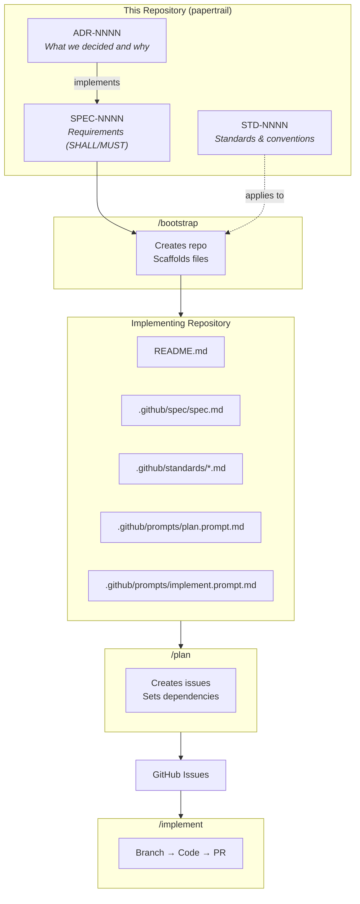

# Papertrail

A documentation repository for Architecture Decision Records (ADRs), technical specifications, and engineering standards—with automated workflows to bootstrap implementing repositories.

## Structure

```
├── docs/
│   ├── decisions/       # Architecture Decision Records (ADRs)
│   │   └── ADR-NNNN-*.md
│   ├── specs/           # Technical Specifications
│   │   └── SPEC-NNNN-*.md
│   └── standards/       # Engineering Standards
│       └── STD-NNNN-*.md
├── templates/           # Scaffolding templates for bootstrapped repos
│   ├── README.md.template
│   ├── mcp.json.template
│   ├── copilot-instructions.md.template
│   ├── plan.prompt.md.template
│   └── implement.prompt.md.template
└── .github/prompts/     # Copilot slash commands
    ├── adr.prompt.md
    ├── spec.prompt.md
    ├── std.prompt.md
    └── bootstrap.prompt.md
```

## Document Hierarchy



| Document | Purpose | Relationship |
|----------|---------|--------------|
| **ADR** | Captures a decision and its rationale | One ADR can have many Specs |
| **Spec** | Defines requirements (SHALL/MUST) for an implementation | References one ADR, lists implementing repos |
| **Standard** | Defines reusable conventions and best practices | Applied to implementations via bootstrap |

## Copilot Commands

### In This Repository (papertrail)

| Command | Description |
|---------|-------------|
| `/adr` | Create a new Architecture Decision Record |
| `/spec` | Create a technical specification implementing an ADR |
| `/std` | Create an engineering standard |
| `/bootstrap` | Bootstrap implementing repositories from a spec |

### In Bootstrapped Repositories

| Command | Description |
|---------|-------------|
| `/plan` | Create or refresh GitHub issues from the spec |
| `/implement` | Implement the next available issue |

## Workflow

### 1. `/bootstrap` (in papertrail)

Creates and scaffolds implementing repositories:

1. **Reads a spec** and identifies implementing repositories
2. **Creates repositories** (internal visibility) if they don't exist
3. **Scaffolds each repo** with:
   - `README.md` - Links to spec and explains the project
   - `.vscode/mcp.json` - GitHub MCP server configuration
   - `.github/copilot-instructions.md` - Instructions to read spec/standards
   - `.github/prompts/plan.prompt.md` - The `/plan` command
   - `.github/prompts/implement.prompt.md` - The `/implement` command
   - `.github/spec/spec.md` - Copy of the specification
   - `.github/standards/*.md` - Applicable standards
4. **Re-bootstrap**: If files exist, shows diff and creates PR to update

### 2. `/plan` (in bootstrapped repo)

Creates GitHub issues from the spec:

1. **Parses the spec** from `.github/spec/spec.md`
2. **Creates tracking issue** for the overall spec
3. **Creates requirement issues** with validation scenarios
4. **Creates task sub-issues** for implementation work
5. **Sets dependencies** using "blocked by" relationships
6. **Refresh support**: Can update existing issues when spec changes

### 3. `/implement` (in bootstrapped repo)

Works through issues systematically:

1. **Finds the next issue** where all dependencies are resolved
2. **Creates a branch** (`implement/issue-{number}-{description}`)
3. **Guides implementation** following spec requirements and standards
4. **Pushes changes** via GitHub MCP
5. **Creates a draft PR** with detailed description and validation checklist

## Document Formats

### ADRs (Architecture Decision Records)

ADRs capture significant architectural decisions along with their context and consequences. We use the [MADR 4.0.0](https://adr.github.io/madr/) format.

**Naming convention**: `ADR-NNNN-short-title.md`

### Specifications

Specs define requirements for implementing ADRs using [OpenSpec-style](https://github.com/Fission-AI/OpenSpec) format:
- SHALL/MUST requirement statements
- GIVEN/WHEN/THEN scenarios for validation
- List of implementing repositories

**Naming convention**: `SPEC-NNNN-short-title.md`

### Standards

Standards define reusable conventions and best practices using [RFC 2119](https://www.rfc-editor.org/rfc/rfc2119) keywords (MUST, SHOULD, MAY). They cover things like:
- Language and framework choices
- Repository structure
- Testing requirements
- Security practices

**Naming convention**: `STD-NNNN-short-title.md`

## Prerequisites

- VS Code with GitHub Copilot extension
- GitHub Copilot subscription (for MCP server authentication)
- Appropriate GitHub permissions for repository creation

## Setup

The repository includes `.vscode/mcp.json` configured with the [GitHub MCP server](https://github.com/github/github-mcp-server). Open the repository in VS Code and the MCP server will be available automatically.

## Templates

Document templates:
- [ADR Template](docs/decisions/adr-template.md)
- [Spec Template](docs/specs/spec-template.md)
- [Standard Template](docs/standards/std-template.md)

Scaffolding templates (used by `/bootstrap`):
- [templates/](templates/)
