# Papertrail

A documentation repository for Proposals, technical specifications, and engineering standards—with automated workflows to bootstrap implementing repositories.

## Structure

```
├── docs/
│   ├── proposals/       # Proposals (PROP)
│   │   └── PROP-NNNN-*.md
│   ├── specs/           # Technical Specifications
│   │   ├── SPEC-NNNN-*.md
│   │   └── SPEC-NNNN-EXT-NNNN-*.md  # Extensions
│   └── standards/       # Engineering Standards
│       └── STD-NNNN-*.md
├── templates/           # Scaffolding templates for bootstrapped repos
│   ├── README.md.template
│   ├── gitignore.template
│   ├── mcp.json.template
│   ├── copilot-instructions.md.template
│   ├── plan.prompt.md.template
│   └── implement.prompt.md.template
├── examples/            # Full conversation examples
│   ├── 01-basic-flow/
│   ├── 02-extension-same-proposal/
│   ├── 03-extension-new-feature/
│   ├── 04-extension-override/
│   └── 05-microservices-dependencies/
└── .github/prompts/     # Copilot slash commands
    ├── propose.prompt.md
    ├── spec.prompt.md
    ├── std.prompt.md
    ├── extend.prompt.md
    ├── bootstrap.prompt.md
    ├── review.prompt.md
    ├── validate.prompt.md
    └── status.prompt.md
```

## Document Hierarchy


| Document | Purpose | Relationship |
|----------|---------|--------------|
| **Proposal** | Explores a problem and proposes potential solutions | One Proposal can have many Specs |
| **Spec** | Defines requirements (SHALL/MUST) for an implementation | References one Proposal, lists implementing repos |
| **Extension** | Adds or overrides requirements in a base spec | Extends a spec, can implement same or different Proposal |
| **Standard** | Defines reusable conventions and best practices | Applied to implementations via bootstrap |

## Whaaaat?

So you want to build something. Here's how Papertrail turns ideas into running code.

### The Journey: Idea → Code

```mermaid
flowchart LR
    subgraph think["1. Think"]
        IDEA["💡 Idea"]
        PROP["📋 Proposal"]
        IDEA --> PROP
    end

    subgraph define["2. Define"]
        SPEC["📐 Spec"]
        STD["📏 Standards"]
    end

    subgraph build["3. Build"]
        REPO["📦 Repository"]
        ISSUES["🎫 Issues"]
        CODE["💻 Code"]
        PR["🔀 PR"]
    end

    PROP -->|"/spec"| SPEC
    SPEC -->|"/bootstrap"| REPO
    STD -.->|"applied"| REPO
    REPO -->|"/plan"| ISSUES
    ISSUES -->|"/implement"| CODE
    CODE --> PR
```



**Step by step:**

1. **Think**: You have a problem. Write a **Proposal** (`/propose`) to explore it—what's wrong, what could fix it, what's the recommendation?

2. **Define**: Once approved, create a **Spec** (`/spec`) with concrete requirements (SHALL/MUST statements). Standards are kept separate—they define *how* you build (TypeScript conventions, testing requirements), not *what* you build.

3. **Build**: Bootstrap (`/bootstrap`) creates your repo with the spec and applicable standards baked in. Then `/plan` creates issues, and `/implement` guides you through each one.

### Extensions: When Plans Change

Real projects evolve. Extensions let you adapt without rewriting history.


**Three extension patterns:**

| Pattern | When to Use | Example |
|---------|-------------|---------|
| **Same proposal, more scope** | You started implementing and realized something's missing | "SPEC-0001 needs a caching layer we didn't think of" |
| **Different proposal, new feature** | A new initiative builds on existing infrastructure | "PROP-0002 (multi-region) extends the runner spec" |
| **Override** | A requirement needs to change | "Monitoring now requires audit logging for compliance" |

### Standards: The How, Not the What

Standards are intentionally decoupled from specs:

- **Specs** define *what* to build (requirements, scenarios, acceptance criteria)
- **Standards** define *how* to build (language conventions, testing rules, security practices)

During `/bootstrap`, you select which standards apply. During `/implement`, Copilot can auto-detect applicable standards based on the tech stack. This means the same spec can be implemented in different ways for different contexts.

### Microservices: When Specs Depend on Each Other

Building a system with multiple services? Specs can declare dependencies:

```
SPEC-0001: User Service (exposes user API)
    └── SPEC-0002: Order Service (depends on User API)
            └── SPEC-0003: Notification Service (depends on Order events)
```

When you `/bootstrap` SPEC-0002, the User Service repo gets cloned into `.contexts/` so you can reference its API. The dependency chain ensures services are built in the right order.

### See It In Action

Check out the [examples/](examples/) directory for full conversation transcripts showing:
- [Basic flow](examples/01-basic-flow/): Proposal → Spec → Bootstrap
- [Extension (same proposal)](examples/02-extension-same-proposal/): Adding scope mid-implementation
- [Extension (new feature)](examples/03-extension-new-feature/): New proposal building on existing spec
- [Extension (override)](examples/04-extension-override/): Changing requirements
- [Microservices](examples/05-microservices-dependencies/): Multi-service system with API dependencies

## Copilot Commands

### In This Repository (papertrail)

#### Document Creation

| Command | Description |
|---------|-------------|
| `/propose` | Create a new Proposal to explore a problem and potential solutions |
| `/spec` | Create a technical specification implementing a Proposal |
| `/extend` | Create an extension to add/override requirements in a spec |
| `/std` | Create an engineering standard |
| `/bootstrap` | Bootstrap implementing repositories from a spec |

#### Review & Validation

| Command | Description |
|---------|-------------|
| `/review` | Review a proposal, spec, or standard against quality checklists with improvement suggestions |
| `/validate` | Cross-reference validation to check YAML frontmatter, references, naming, and status consistency |
| `/status` | Display overview table of all documents and their implementation status |

### In Bootstrapped Repositories

| Command | Description |
|---------|-------------|
| `/plan` | Create or refresh GitHub issues from the spec and extensions |
| `/implement` | Implement the next available issue |

## Workflow

### 1. `/bootstrap` (in papertrail)

Creates and scaffolds implementing repositories:

1. **Reads a spec** and any extensions
2. **Creates repositories** (internal visibility) if they don't exist
3. **Scaffolds each repo** with:
   - `README.md` - Links to spec and explains the project
   - `.gitignore` - Ignores `.contexts/`, `.plans/`, and standard-specific patterns
   - `.vscode/mcp.json` - GitHub MCP server configuration
   - `.github/copilot-instructions.md` - Instructions to read spec/standards
   - `.github/prompts/plan.prompt.md` - The `/plan` command
   - `.github/prompts/implement.prompt.md` - The `/implement` command
   - `.github/spec/spec.md` - Copy of the specification
   - `.github/spec/extensions/*.md` - Any extensions
   - `.github/standards/*.md` - Applicable standards
4. **Re-bootstrap**: If files exist, shows diff and creates PR to update

### 2. `/extend` (in papertrail)

Creates extensions to existing specs:

1. **Select base spec** to extend
2. **Choose Proposal** - same as base or different
3. **Add new requirements** or **override existing ones**
4. Creates `SPEC-NNNN-EXT-NNNN-*.md` file

Extensions are useful when:
- Implementation has started and you need to add scope
- A new Proposal adds requirements to an existing system
- You need to adapt a spec without modifying the original

### 3. `/plan` (in bootstrapped repo)

Creates GitHub issues from the spec and extensions:

1. **Parses the spec** from `.github/spec/spec.md`
2. **Parses extensions** from `.github/spec/extensions/`
3. **Clones spec dependencies** into `.contexts/` (shallow clone of main)
   - If a dependent spec has multiple implementing repos, asks which to clone
4. **Creates tracking issue** for the overall spec
5. **Creates requirement issues** (base + extension requirements)
6. **Handles overrides** - closes original, creates replacement issue
7. **Sets dependencies** using "blocked by" relationships
8. **Extension-only mode** - can add just extension issues if base already planned

### 4. `/implement` (in bootstrapped repo)

Works through issues systematically:

1. **Finds the next issue** where all dependencies are resolved
2. **Creates a branch** (`implement/issue-{number}-{description}`)
3. **Guides implementation** following spec requirements and standards
4. **Pushes changes** via GitHub MCP
5. **Creates a draft PR** with detailed description and validation checklist

### 5. `/review` (in papertrail)

Reviews documents against quality checklists:

1. **Identifies document type** (Proposal, Spec, Extension, or Standard)
2. **Validates structure** against the appropriate template
3. **Checks content quality** (clarity, completeness, consistency)
4. **Validates cross-references** to other documents
5. **Provides actionable suggestions** with severity levels
6. **Offers to apply changes** or update document status

### 6. `/validate` (in papertrail)

Cross-reference validation across all documents:

1. **Validates YAML frontmatter** (required fields, valid values)
2. **Checks document references** (specs reference existing proposals, etc.)
3. **Verifies naming conventions** (PROP-NNNN, SPEC-NNNN, STD-NNNN)
4. **Detects orphaned documents** (specs without proposals, etc.)
5. **Checks status consistency** (implementation status matches document status)
6. **Outputs validation report** with errors, warnings, and info

### 7. `/status` (in papertrail)

Displays overview of all documents:

1. **Lists all documents** with type, ID, title, and status
2. **Shows implementation tree** (Proposal → Specs → Extensions → Repos)
3. **Supports filtering** by status or specific document
4. **Highlights action items** (drafts needing review, blocked implementations)

## Document Formats

### Proposals

Proposals explore problems and potential solutions. They capture the "what" and "why" before diving into implementation details.

**Naming convention**: `PROP-NNNN-short-title.md`

Key sections:
- Problem Statement - What problem are we trying to solve?
- Goals / Non-Goals - What's in and out of scope?
- Background - Context and previous attempts
- Proposed Direction - Options with pros/cons
- Recommendation - Which option and why

### Specifications

Specs define requirements for implementing Proposals using [OpenSpec-style](https://github.com/Fission-AI/OpenSpec) format:
- SHALL/MUST requirement statements
- GIVEN/WHEN/THEN scenarios for validation
- List of implementing repositories
- Spec Dependencies section for referencing other specs (APIs, services to integrate with)

**Naming convention**: `SPEC-NNNN-short-title.md`

### Extensions

Extensions add or override requirements in a base spec:
- Can implement the same or a different Proposal
- "Added Requirements" section for new requirements
- "Overridden Requirements" section to replace base requirements

**Naming convention**: `SPEC-NNNN-EXT-NNNN-short-title.md`

### Standards

Standards define reusable conventions and best practices using [RFC 2119](https://www.rfc-editor.org/rfc/rfc2119) keywords (MUST, SHOULD, MAY). They cover things like:
- Language and framework choices
- Repository structure
- Testing requirements
- Security practices
- Optional `gitignore` patterns to add to implementing repos

**Naming convention**: `STD-NNNN-short-title.md`

## Special Directories in Bootstrapped Repos

### `.contexts/` - Read-Only Reference

Contains shallow clones of repositories that implement specs this project depends on (from the "Spec Dependencies" section). Use this to understand APIs, data formats, or services you're integrating with.

**Important:** Never modify files in `.contexts/` - it exists only for reference.

### `.plans/` - Copilot Scratchpad

A workspace for Copilot to create:
- Implementation plans and notes
- Design documents
- Research summaries
- Any working documents that shouldn't be in git history

Both directories are gitignored automatically.

## Prerequisites

- VS Code with GitHub Copilot extension
- GitHub Copilot subscription (for MCP server authentication)
- Appropriate GitHub permissions for repository creation

## Setup

The repository includes `.vscode/mcp.json` configured with the [GitHub MCP server](https://github.com/github/github-mcp-server). Open the repository in VS Code and the MCP server will be available automatically.

## Templates

Document templates:
- [Proposal Template](docs/proposals/proposal-template.md)
- [Spec Template](docs/specs/spec-template.md)
- [Spec Extension Template](docs/specs/spec-extension-template.md)
- [Standard Template](docs/standards/std-template.md)

Scaffolding templates (used by `/bootstrap`):
- [templates/](templates/)
